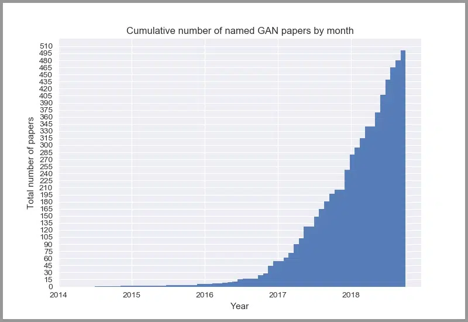
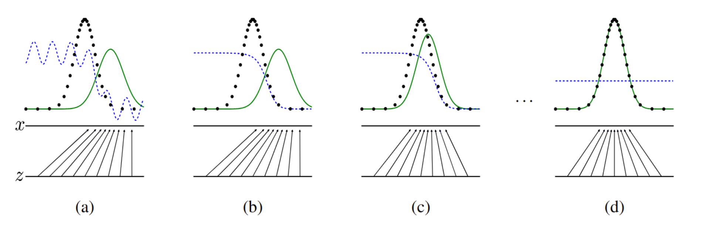
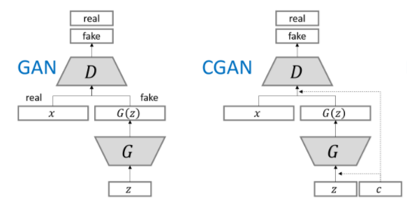
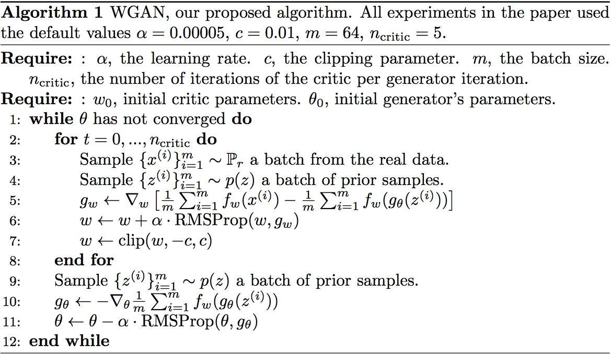
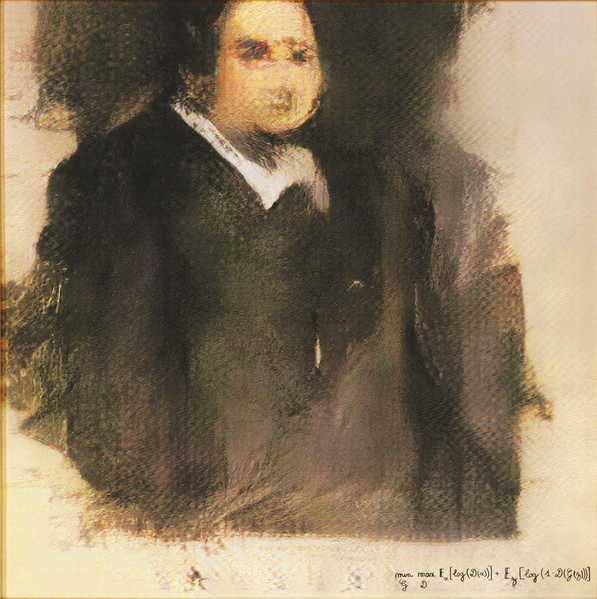
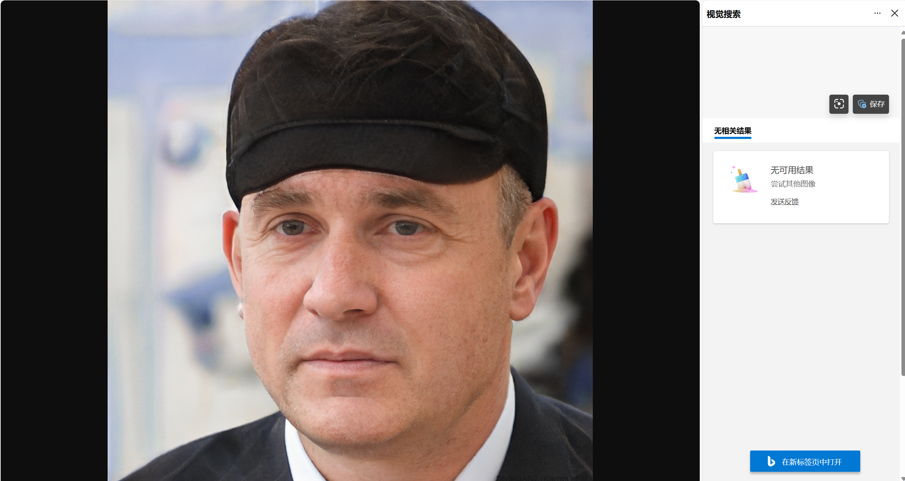
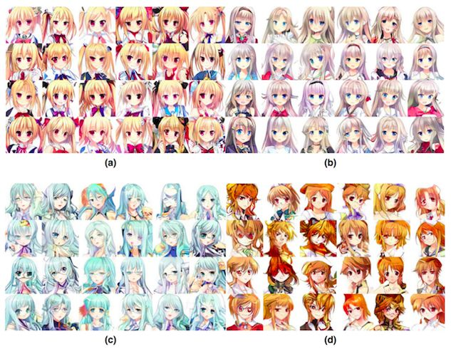

+++
date = '2024-01-18T00:00:00+08:00'
draft = false
title = '生成对抗网络'
aliases = ['/2024/01/18/生成对抗网络/']
tags = ['GAN', 'Machine Learning']
categories = ['Learning']
+++
~~本文是数据科学导论期末大作业展示的报告，拿来随便水一篇博客hh~~

## 0 引言

生成对抗网络 (Generative Adversarial Network, GAN) 是一种十分流行的机器学习模型。自2014年Ian Goodfellow等人首次提出以来，GAN迅速在学术界和工业界引发了热烈的反响，许多有影响力的工作层出不穷。图一是累积的GAN论文数量，其火热程度可见一斑。



Figure 1: Cumulative number of GAN papers

本文将对GAN做简要介绍，主要包括GAN原始模型、经典变体和应用成就。

## 1 原始模型

### 1.1 基本思想

GAN全称为生成对抗网络。顾名思义，其在本质上是一种生成模型，它最突出的特点是使用判别器与生成器进行对抗式训练，后者负责产生贴近真实的数据，前者则负责努力辨别生成数据和真实数据。当训练迭代至一定次数后，生成器产生的数据便足够逼真，训练目的因而得到实现。

对此，GAN的原始论文[^1]中给出了一个通俗的解释：

> 生成器是“假钞制造团伙”，负责制造能在市场上流通的假钞；判别器则是“警察”，负责识破假钞。假钞制造团伙和警察之间不断竞争，警察的鉴别能力和团伙的造假能力都不断提升，最终，造假团伙制造的假钞足以以假乱真：“假钞变成了真钞”。

**GAN就是在制造足以以假乱真的假钞。**

### 1.2 基本步骤

概括来说，GAN的训练主要分为以下三步：

1.  **固定生成器$G$，训练判别器$D$：** 使 $D$ 尽可能准确地识别出样本究竟是由生成器生成的（来自 $p_z(z)$）还是来自真实数据集（来自 $p_{data}(x)$）
2.  **固定判别器$D$，训练生成器$G$：** 使 $G$ 生成的样本($G(z)$)尽可能贴近真实样本，即让生成器$G$骗过判别器$D$
3.  **迭代：** 循环1. 2.至一定次数，此时生成器$G$产生的样本足以“以假乱真”，判别器$D$辨认真实样本和生成样本成功的概率都为$\frac1 2$，二者达到了纳什平衡[^2]。

> 训练示意图：
>
> Figure 2: 训练过程示意图
>
> 图中，$z$轴是输入生成器的随机噪声，其通过生成器(箭头)映射到样本集$x$轴。黑色散点是真实数据集；绿色实线是生成样本集，蓝色虚线是判别器（越远离$x$轴，其值越接近于1，即其认为该样本来自真实数据集的概率越大）。
>
> (a)中，判别器曲线(蓝色虚线)较为颠簸，判别效果较差，因此(a)到(b)首先对判别器进行训练；(b)到(c)则对生成器进行训练，使得生成样本曲线(绿色实线)更贴近真实样本集(黑色散点)。当迭代此二步到一定次数后，绿色实线和黑色散点接近重合，判别器曲线也恒为$1 \over 2$，即无法将生成样本和真实数据进行区分。

### 1.3 具体算法

**记号说明**

- 生成器和判别器均为多层神经网络：$G(z;\theta _g)$和$D(x;\theta _d)$
- $G$通过参数$\theta_g$将噪声$z$映射为生成样本$G(z;\theta _g)$
- $D$通过参数$\theta_d$将样本映射为$[0,1]$的标量$D(x;\theta _d)$，其值越接近1表示为真实数据的概率越大
- 目标，求解值函数$V(D,G)$的极小极大值，即：

$$
\min_G\max_D V(D,G)=\mathbb{E}_{x\sim p_{data}(x)}[\log D(x)]+\mathbb{E}_{z\sim p_z(z)}[\log(1-D(G(z)))]
$$

**具体求解步骤**

```text
for 1 to n do
    for 1 to k do
        从噪声集取出 m 个样本 {z^(1), z^(2), ..., z^(m)}
        从真实数据集中取出 m 个样本 {x^(1), x^(2), ..., x^(m)}
        使用梯度上升法更新判别器的参数 theta_d
    end for
    从噪声集中取出 m 个样本 {z^(1), z^(2), ..., z^(m)}
    使用梯度下降法更新生成器的参数 theta_g
end for
```

更新判别器的参数 $\theta_d$ 时使用梯度上升法[^3]：

$$
\nabla_{\theta_d}\frac{1}{m}\sum_{i=1}^{m}[\log D(x^{(i)})+\log D(1-D(G(z^{(i)})))].
$$

更新生成器的参数 $\theta_g$ 时使用梯度下降法：

$$
\nabla_{\theta_d}\frac{1}{m}\sum_{i=1}^{m}[\log (1-D(G(z^{(i)})))].
$$

> k是一个超参数；之所以更新k次$D$才更新1次$G$，是因为只有判别器足够好，生成器的更新才准确有效。

## 2 经典变体

GAN作为风靡一时的机器学习模型，自然少不了各种改进和变体。本部分选取了三种较有代表性和影响力的变体进行介绍：CGAN、DCGAN和WGAN。

### 2.1 CGAN

原始 GAN 模型[^4]中，输入生成器的是随机噪声，因此最后产生的图像的随机性也相对较大。倘若我们想要获得具有某种特征和标签的图像，就需要从生成的一大堆样本中进行挑选，较为繁琐。

CGAN(Conditional Generative Adversarial Networks)便是为了解决这一问题而产生的。其思想也十分朴素，即向生成器和判别器的输入中添加条件信息。这样一来，生成样本不仅需要足够逼真，还要满足特定的条件才能通过判别器：

$$
\min_G\max_D V(D,G)=\mathbb{E}_{x\sim p_{data}(x)}[\log D(x|y)]+\mathbb{E}_{z\sim p_z(z)}[\log(1-D(G(z|y)))]
$$



Figure 3: CGAN和GAN的对比

### 2.2 DCGAN

DCGAN[^5] (Deep Convolutional Generative Adversarial Networks) 全称为深度卷积对抗生成网络。顾名思义，其主要想法是将卷积神经网络(CNN)和GAN进行结合，在不改变GAN的基本原理的情况下较为有效地改善了其训练不稳定的问题。

DCGAN做出的主要改变有：

- 使用卷积层和转置卷积层：引入了转置卷积层和卷积层分别作为生成器和判别器网络的主要组件。

- 去除全连接层：用全卷积层代替。

- 批归一化(Batch Normalization)：生成器和判别器都使用BN层。

- 修改激活函数：生成器输出层使用Tanh，其余层使用ReLU；判别器均使用LeakyReLU


Figure 4: 生成器转置卷积层示意图

### 2.3 WGAN

WGAN[^6] (Wasserstein Generative Adversarial Networks) 引入了Wasserstein距离代替原来的JS散度作为GAN的损失函数，彻底解决了GAN训练不稳定的问题，是GAN发展史上里程碑式的工作之一。



Figure 5: WGAN算法

可见，WGAN做出的最主要改动，即是对损失函数的更换。此外，其还做出了如下改变：

- 判别器最后一层去掉sigmoid
- 每次更新判别器的参数之后把它们的绝对值截断到不超过一个固定常数c
- 不要用基于动量的优化算法（包括momentum和Adam），推荐RMSProp，SGD也行

改进虽然简单，但是成效巨大。

## 3 应用举例

### 3.1 「Edmond de Belamy」

在2018年末的佳士得纽约拍卖场上，来自巴黎的艺术团队*Obvious*使用GAN生成的画作「Edmond de Belamy」以超出估价40倍的43.25万美元成交，其右下角便印有纵横GAN领域的著名公式： $\min_G\max_D \mathbb{E}_{x}[\log D(x)]+\mathbb{E}_{z}[\log(1-D(G(z)))]$

1968年，毕加索曾说：”计算机是没有用的。它们只会告诉你答案”。但在同一场拍卖会上，没有一幅毕加索的画作成交价格超过了「Edmond de Belamy」，这不禁令人唏嘘不已。



Figure 6: 「Edmond de Belamy」

### 3.2 This Person Does Not Exist

[thispersondoesnotexist.com](https://thispersondoesnotexist.com/) 每次进入该网址，都会生成一张世界上并不存在的人脸，而这正是使用GAN进行生成的。



Figure 7: This Person Does Not Exist

### 3.3 二次元头像生成

使用GAN[^7]，你可以随心所欲生成二次元~~老婆~~头像：



Figure 8: GAN生成的二次元头像

## 4 总结

GAN是一种应用广泛、潜力巨大的生成模型。它使用判别器和生成器进行对抗性训练，并最终产生足够逼真的图像。但GAN在训练过程中通常存在生成样本过于随机、训练不稳定等缺点，因此涌现出了诸多变体对其进行改进：CGAN、DCGAN、WGAN ……

我们期待在将来能看到更具潜力的GAN模型和更富价值的GAN应用！

[^1]: Goodfellow, I. J., Pouget-Abadie, J., Mirza, M., Xu, B., Warde-Farley, D., Ozair, S., Courville, A., & Bengio, Y. (2014, June 10). *Generative Adversarial Networks*. <https://arxiv.org/abs/1406.2661>

[^2]: 事实上，这种“纳什平衡”是一种理想状态，实际训练难以达到。

[^3]: 关于梯度下降/上升法，可参考[什么是梯度下降法？ - 马同学的回答 - 知乎](https://www.zhihu.com/question/305638940/answer/1639782992)。

[^4]: Mirza, M., & Osindero, S. (2014, November 6). *Conditional generative adversarial nets*. <https://arxiv.org/abs/1411.1784>

[^5]: Radford, A., Metz, L., & Chintala, S. (2016, January 7). *Unsupervised representation learning with deep convolutional generative Adversarial Networks*. <https://arxiv.org/abs/1511.06434>

[^6]: [令人拍案叫绝的 Wasserstein GAN - 郑华滨的文章 - 知乎](https://zhuanlan.zhihu.com/p/25071913)

[^7]: Jin, Y., Zhang, J., Li, M., Tian, Y., Zhu, H., & Fang, Z. (2017, August 18). *Towards the automatic anime characters creation with Generative Adversarial Networks*. <https://arxiv.org/abs/1708.05509>
